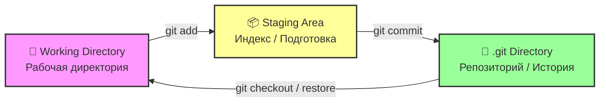

## Git

### Git - начало

> **Git** - это распределенная система контроля версий, которая фиксирует изменения в файлах с течением времени, позволяя в любой момент вернуться к конкретной версии проекта

---

## Архитектура систем контроля версий

### 1. Локальная система
```
-- Local PC --
Checkout          Version Database
    |                  |
    |                  |
  Files -----------> Version 1
                     Version 2
                     Version 3
```
### 2. Центролизованная система (SVN)
```
-- PC (A) --    Central VCS Server
      |          
	  |         Version Database
	  |                |
	Files ------------ |
                  Version 1
-- PC (B) --      Version 2
      |           Version 3
      |                |
      |                |
    Files ------------ | 
```
### 3. Распределенная система (Git)
```
         Server Computer
		 
		 Version Database
		        |
				|
		    Version 1
			Version 2
			Version 3
			    |
				|
	 |----------|----------|
-- PC (A) --           -- PC (B) --
     |                     |
     |                     |
    Files                Files
     |                     |
     |                     |
  Version Database ---- Version Database
     |                     |
     |                     |
  Version 1              Version 1
  Version 2              Version 2
  Version 3              Version 3
```			  
  
### Как Git хранит данные: Снимки

Git рассматривает данные как серию снимков файловой системы
При изменении или сохранении своего проекта, Git делает снимок того, как выглядят ваши файлы в этот момент, и сохраняет ссылку на этот снимок

```
Version 1       Version 2        Version 3        Version 4       Version 5
    |               |                |                |               |
    |               |                |                |               |
  Files A           A1               A1               A2              A2
    |               |                |                |               |
    |               |                |                |               |
  Files B           B                B                B1              B2
    |               |                |                |               |
    |               |                |                |               |
  Files C 	        C1               C2               C2              C3
```  
#### Три состояния

В Git есть три основных состояния, в которых могут находится ваши файлы : измененный, подготовленный и зафиксированный

- "Измененный" означает, что вы изменили файл, но Git еще не знает об этом
- "Подгтовленный" означает, что вы указали Git, что эти изменения войдут в следующий коммит
- "Зафиксированный" означает, что данные надежно сохранены в локальной базе Git



### Основные команды Git

- Указывает имя автора коммита: ` git config --global user.name "Имя" `
- Указывает email автора: ` git config --global user.email test@example.com `
- Задает текстовый редактор по умолчанию: ` git config --global core.editor "notepad" `
- Меняет имя ветки по умолчанию: ` git config --global init.defaultBranch main `
- Показывает все настройки и откуда они взяты: ` git config --list --show-origin `
- Получаем помощь: ` git help `
- Доступные параметры: ` git add -h `

### Начало работы
- Инициализирует новый Git-репозиторий в текущей папке: ` git init `
- Клонирует (скачивает) существующий репозиторий с сервера: ` git clone `

### Сохранение изменений
- Проверка состояния файлов: ` git status `
- Добавляем конкретный файл в индекс (подготовку): ` git add <file> `
- Добавляем все файлы в индекс: ` git add . `
- Фиксирует подготовленные изменения с комминтарием: ` git commit -m "Сообщение" `
- Позволяет изменить сообщение последнего коммита или добавить забытые файлы: ` git commit --amend `

### Ветвление и слияние
- Показывает список локальных веток: ` git branch `
- Создает новую ветку: ` git branch <имя> `
- Переключается на указанную ветку: ` git checkout <имя> `
- Создает новую ветку и сразу переключается на нее: ` git checkout -b <имя> `
- Вливает изменения из указанной ветки в текущую: ` git merge <имя> `

### Работа с удаленными репозиториями
- Показывает список привязанных удаленных репозиториев: ` git remote -v `
- Привязывает удаленный репозиторий с именем origin: ` git remote add origin <url> `
- Скачивает изменения с сервера, но не применяет их: ` git fetch `
- Скачивает изменения с сервера и сразу приминяет их (fetch + merge): ` git pull `
- Отправляет ваши локальные коммиты на удаленный сервер: ` git push `
- Отправляет коммиты и привязывает локальную ветку к удаленной: ` git push -u origin main `
- Переименовывает удаленные репозитории: ` git remote rename `
- Удаление удаленные репозитории: ` git remote rm `

### Просмотр и отмена действий
- Показывает историю коммитов: ` git log `
- Показывает историю коммитов в виде компактного графа: ` git log --oneline --graph `
- Показывает различия между рабочей директорией и индексом: ` git diff `
- Отменяет изменения в файле (Возвращает к последнему коммиту): ` git restore <файл> `
- Убирает файл из индекса, но сохраняет изменения в файле: ` git restore --staged <файл> `
- Удаляет файл из рабочей директории и из индекса: ` git rm <файл> `
- Переименовывает или перемещает файл: ` git mv <старое> <новое> `

### Временное сохранение
- Временно прячет незафиксированные изменения: ` git stash `
- Возвращает спрятанные изменения и удаляет их из списка stash: ` git stash pop `

### Теги
- Показывает список всех тегов в репозитории: ` git tag `
- Создает легковесный тег с именем `v1.0.0` на текущем коммите: ` git tag v1.0.0 ` 
- Создает аннотированный тег с сообщением: ` git tag -a v1.0.0 -m "Релиз версии 1.0" `
- Отправляет конкретный тег на удаленный сервер: ` git push origin v1.0.0 `
- Отправляет все локальные теги на сервер: ` git push origin --tags `

### Сброс и отмена действий
> **Внимание:** Используйте ` git reset ` осторожно, особенно с флагом ` --hard `, так как это может привести к безвозвратной потере изменений!

- Убирает файл из индекса (подготовки), но **сохраняет** изменения в самом файле (аналог `git restore --staged`): ` git reset <файл> `
- Отменяет последний коммит, но **оставляет** все изменения в индексе (подготовленными): ` git reset --soft HEAD~1 `
- Отменяет последний коммит и убирает изменения из индекса, но **сохраняет** их в файлах (режим по умолчанию): ` git reset --mixed HEAD~1 `
- **ОПАСНО:** Полностью отменяет последний коммит и **безвозвратно удаляет** все изменения в файлах: ` git reset --hard HEAD~1 `

### Спасаем данные
> Если вы случайно удалили ветку, сделали hard reset или потеряли коммит – это не конец света.

- Показывает историю ВСЕХ ваших действий (даже удаленных коммитов и сброшенных веток): ` git reflog `
- Возвращает состояние репозитория к N-му шагу из reflog: ` git reset --hard HEAD@{N} `

### Работа с историей
- Интерактивный ребейз последних 3 коммитов. Позволяет объединить (squash) несколько мелких коммитов в один чистый перед пушем: ` git rebase -i HEAD~3 `
- Берет изменения из одного конкретного коммита (например, из другой ветки) и применяет их к текущей ветке: ` git cherry-pick <commit-hash> `

### Поиск проблемы
- Запускает режим бинарного поиска: ` git bisect start `
- Помечает текущий коммит как "сломанный": ` git bisect bad `
- Помечает коммит, где всё работало. Git будет автоматически переключать вас между коммитами, пока вы не найдете тот, где появилась ошибка: ` git bisect good <good_commit> `
- Завершает поиск и возвращает вас в исходную ветку: ` git bisect reset `

### Нюансы
- Скачивает только последний коммит (без всей истории): ` git clone --depth 1 <url> `
- Файл, который указывает Git, какие файлы **игнорировать** (пароли, `.env`, папки `node_modules`, `venv`, `.idea`, скомпилированные бинарники). *Никогда не коммитьте секреты!*: ` .gitignore `
- Показывает все файлы, которые Git сейчас отслеживает (полезно для проверки, не попал ли случайно секретный файл в индекс): ` git ls-files `

### Вопрос - ответ
1. В чем разница merge / rebase? 
- **Git merge** обьединяет ветки создавая дополнительно merge commit. (История разветвлений. Видно как ветки сливались. Безопасно и сохраняется весь контекст)
- **Git rebase** переносит комиты на самый последний(свежий) комит основной ветки. Переписывает историю так, как будто вы начали работу после всех последний изменений. История становится линейной и чистой
> **Внимание:** rebase нельзя делать для веток которые уже кто-то использует.

2. Представим что вы сделали полезний комит в какой-нибудь ветке, но не хотите тянуть туда весь основной код, как поступить?
- В этом случае можно взять только нужный коммит использовав ` git cherry-pick ` (Из плюсов - быстрый перенос отдельных изменений в нужную ветку не затрагивая основной код.
  Из минусов - теряется контекст и могут возникнуть дублирования кода и лишние конфликты если часто использовать данную команду.)
  
3. В чем разница между **git pull** и **git fetch**?
- **git fetch** только скачивает изменения с удаленного репозитория в локальный .git, но не применяет их к вашим файлам.
- **git pull** = git fetch + git merge. Он скачивает изменения и сразу пытается слить их с текущей веткой, что может привести к конфликтам, если вы тоже что-то меняли.
> **Совет:** Лучше использовать ` git fetch `, смотреть изменения (` git log HEAD.. origin/main `), и только после этого использовать ` git merge `

4. Как правильно отменить коммит: **git reset** или **git revert**?
- **Git reset** переписывает историю, буквально "стирая" коммиты. Это опасно для общих веток (main, develop), так как сломает историю у других разработчиков.
- **Git revert** создает новый коммит, который является полной противоположностью отменяемому (откатывает изменения). История сохраняется, это безопасно для командной работы.

5. Что такое конфликт слияния (merge conflict) и как его решить?
- Возникает, когда Git не может автоматически объединить изменения (например, одна и та же строка кода изменена по-разному в двух ветках, или файл удален в одной ветке и изменен в другой).
- **Решение:**
    1. Открыть файл с конфликтом и найти маркеры: <<<<<<<, =======, >>>>>>>.
	2. Вручную выбрать нужный код или грамотно объединить оба варианта.
	3. Удалить маркеры.
	4. Добавить файл в индекс: ` git add <файл> `.
	5. Завершить слияние: ` git commit ` (или ` git rebase --continue `).
	
6. Я добавил файл в .gitignore, но Git все равно его отслеживает и предлагает закоммитить. Почему?
- ` .gitignore ` игнорирует только новые, неотслеживаемые файлы. Если файл уже был когда-то добавлен в индекс (` git add `) и закоммичен, Git продолжит следить за его изменениями, игнорируя правила ` .gitignore `.
- **Решение:** Нужно удалить файл из кэша Git, сохранив его на диске: ` git rm --cached <файл> `, затем сделать коммит. После этого ` .gitignore ` заработает.

7. Что значит состояние "detached HEAD" (оторванная голова) и как из него выйти?
- Это состояние возникает, когда вы переключаетесь не на ветку, а на конкретный коммит по его хешу или тегу (` git checkout <hash> `). В этом состоянии новые коммиты ни к чему не привязаны и могут быть безвозвратно удалены при переключении.
- **Решение:** Если сделанные изменения нужны, создайте из этого состояния новую ветку: ` git checkout -b <имя_новой_ветки> `. Если не нужны, просто вернитесь в основную ветку: ` git checkout main `.

8. Зачем нужен **git stash** и когда его применять?
- Когда вы начали работу над задачей, но нужно срочно переключиться на другую ветку (например, чтобы поправить критический баг), а ваши текущие изменения еще "сырые" и их нельзя коммитить.
- **git stash** прячет изменения, делая рабочую директорию чистой. Вернуть их на место можно командой ` git stash pop `

9. Что такое "squash" коммитов и зачем это нужно?
- Это объединение нескольких мелких или промежуточных коммитов (например: "fix typo", "update", "fix again") в один большой и осмысленный коммит перед слиянием в основную ветку.
- **Зачем:** Делает историю проекта чистой, понятной и удобной для чтения (и для отката, если что-то пойдет не так). Делается через интерактивный ребейз: ` git rebase -i HEAD~N `.

10. Что такое **HEAD** в Git?
- **HEAD** — это указатель (ссылка), который показывает, на каком коммите или ветке вы находитесь прямо сейчас.
- **HEAD~1** означает "предыдущий коммит относительно текущего", **HEAD~2** — коммит перед предыдущим, и так далее.

### Редкие проблемы
1. Работа с историей и ветками
- Конфликты при git rebase с множеством коммитов: При ребейзе нескольких коммитов Git будет останавливаться на каждом конфликтном коммите.
    - **Решение:** Исправь конфликт - ` git add <файл> ` - ` git rebase --continue `. Если запутался: ` git rebase --abort `(вернет всё как было до начала rebase).
- **Git Bisect** в сложных случаях: Бинарный поиск бага. Если тесты автоматизированы, можно не переключать коммиты вручную, а использовать: ` git bisect run <команда_теста> `. Git сам найдет сломанный коммит.
- **Reflog** в сложных сценариях: ` git reflog ` хранит историю только локально и ограничен по времени (по умолчанию 90 дней). Если нужно восстановить ветку, удаленную неделю назад: ` git branch <имя> HEAD@{N} `.

2. Удаленные репозитории и клонирование
- Несколько удаленных репозиториев (Upstream / Fork): Актуально для Open Source. Чтобы тянуть обновления из оригинала, а пушить в свой форк:
    1. ` git remote add upstream <url_оригинала> `
    2. ` git fetch upstream `
    3. ` git rebase upstream/main (или merge) `
- Shallow clone и его ограничения: ` git clone --depth 1 ` ускоряет загрузку, но обрезает историю.
    - Проблема: Нельзя сделать полноценный ` rebase ` или ` push ` в некоторых случаях.
    - Решение: "Разглубить" репозиторий позже: ` git fetch --unshallow `.
- Проблемы с SSH-ключами: Если на одном ПК несколько аккаунтов (личный и рабочий).
    - **Решение:** Настроить файл ~/.ssh/config, создав алиасы для разных хостов с разными ключами (IdentityFile).

3. Специфичные функции и большие данные
- Git Submodules (Подмодули): Репозиторий внутри репозитория.
    - Головная боль: После git clone подмодули пусты.
    - **Решение:** Всегда клонировать с флагом: ` git clone --recurse-submodules <url> ` или обновлять существующий: ` git submodule update --init --recursive `.
- Git LFS (Large File Storage): Хранит не сам большой файл в Git, а текстовый "указатель" (pointer), а сам файл грузит на отдельный сервер.
    - **Команды:** ` git lfs install `, ` git lfs track "*.mp4" `, затем обычный ` git add `.
- Git Worktree: Позволяет проверить другую ветку в отдельной папке, не прерывая текущую работу и не используя stash.
    - **Команда:** ` git worktree add ../temp_folder feature-branch ` (чтобы удалить потом: ` git worktree remove ../temp_folder `).
- Sparse Checkout (Частичная выгрузка): Нужен для огромных монорепозиториев, когда нужна только одна папка.
    - **Команда:** ` git sparse-checkout init --cone `, затем ` git sparse-checkout set <путь_к_папке> `.
- Производительность на больших репо: Если git status тормозит, возможно, в .git накопился мусор.
    - **Решение:** ` git gc --prune=now ` (сборка мусора и оптимизация базы).
	
4. Настройка окружения и автоматизация
- Git Hooks (Хуки): Скрипты в папке .git/hooks/ (например, pre-commit, pre-push).
    - **Проблема:** Не копируются при ` git clone ` (так как .git не версионируется).
    - **Решение:** Использовать инструменты вроде Husky (JS) или pre-commit (Python), которые автоматически настраивают хуки у всех разработчиков.
- Проблемы с кодировками и EOL (CRLF vs LF): Windows использует CRLF, Linux/macOS – LF. Git может видеть "изменения" во всех файлах.
    - **Решение (для Windows):** ` git config --global core.autocrlf true ` (конвертирует в CRLF при checkout, обратно в LF при commit).
    - **Решение (для Linux/macOS):** ` git config --global core.autocrlf input `.
- Проблемы с правами доступа (permissions): При работе между Windows и Linux Git может думать, что изменились права на файл (chmod), хотя содержимое то же.
    - **Решение:** Игнорировать изменения прав: ` git config core.fileMode false `.
- Фильтры и атрибуты (` .gitattributes `): Позволяет указать Git, как обрабатывать файлы. Например, запретить Git'у пытаться делать merge для бинарных файлов: ` *.png binary `, или игнорировать пробелы при merge: ` *.php merge=union `.

###  DevOps-специфика: Git в CI/CD, безопасность и релизы
> DevOps-инженер смотрит на Git не только как на хранилище кода, но и как на источник событий для автоматизации и объект защиты.

1. Безопасность и управление доступом (Governance)
- Защита веток (Branch Protection Rules): Запрет force push и прямого пуша в main/master. Обязательное прохождение CI-проверок и Code Review перед мержем.
- Файл ` CODEOWNERS `: Специальный файл в корне репозитория, который автоматически назначает ревьюверов на Pull Request в зависимости от измененных путей (например, ` *.tf @devops-team `).
- **Подпись коммитов** (GPG Signing): Гарантия того, что коммит действительно сделан заявленным автором, а не злоумышленником, подделавшим email.
    - **Проверка:** ` git log --show-signature `
- Очистка истории от секретов: Если пароль или токен попал в коммит, ` git rm ` не поможет (он останется в истории).
    - **Решение:** Использовать ` git filter-repo ` (современная замена устаревшему git filter-branch) для полного вырезания файла из всей истории, followed by ` git push --force `.

2. Git и CI/CD пайплайны
- **Webhooks:** Механизм, с помощью которого Git-сервер (GitHub/GitLab) отправляет HTTP-запрос в CI-систему (Jenkins, ArgoCD) при событии (push, PR created).
- Оптимизация клонирования в CI: В пайплайнах полная история часто не нужна. Используют ` git clone --depth 1 ` или настройки CI (например, ` fetch-depth: 1 ` в GitHub Actions) для ускорения запуска.
- Если в CI нужна история (для версионирования): Используют ` fetch-depth: 0 `, чтобы инструменты вроде ` git describe ` или генераторы changelog могли прочитать теги и историю коммитов.

3. Релиз-инжиниринг и версионирование
- Semantic Versioning (SemVer) + Git Tags: Связка тегов формата v1.2.3 (Major.Minor.Patch) с релизами в CI/CD.
    - Получить текущий тег: ` git describe --tags --abbrev=0 `
    - Получить количество коммитов с тега: ` git rev-list --count <тег>..HEAD `
- Генерация Changelog: Автоматическое создание списка изменений на основе сообщений коммитов (особенно если используется Conventional Commits: feat:, fix:, chore:).
    - **Пример:** ` git log v1.0.0..v1.1.0 --pretty=format:"- %s (%h)" ` 

4. Серверная часть и администрирование
- Bare-репозитории: Репозиторий без рабочей директории (только папка .git). Именно так выглядят репозитории на серверах (GitHub/GitLab).
    - **Создание:** ` git init --bare `
- Хуки на стороне сервера (Server-side hooks): В отличие от локальных (pre-commit), серверные хуки (pre-receive, update) выполняются на Git-сервере перед принятием пуша. Идеальны для DevOps: можно заблокировать пуш, если в коде найдены секреты или нарушен формат коммита.

5. Monorepo и масштабирование
- **Проблема:** Один репозиторий на все сервисы (код + инфраструктура). ` git clone ` становится медленным, CI запускается для всего подряд.
- **Решение:**
    1. Git Sparse Checkout (встроенный Git): скачивать только нужные папки.
	2. Git LFS: для хранения тяжелых артефактов отдельно.
	3. CI Path Filtering: запускать пайплайн только если изменения коснулись конкретной папки (например, paths: ['apps/backend/**']).