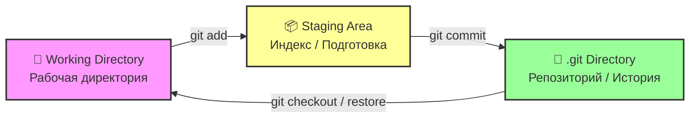

## Git

### Git - начало

> **Git** - это распределенная система контроля версий, которая фиксирует изменения в файлах с течением времени, позволяя в любой момент вернуться к конкретной версии проекта

---

## Архитектура систем контроля версий

### 1. Локальная система
```
-- Local PC --
Checkout          Version Database
    |                  |
    |                  |
  Files -----------> Version 1
                     Version 2
                     Version 3
```
### 2. Центролизованная система (SVN)
```
-- PC (A) --    Central VCS Server
      |          
	  |         Version Database
	  |                |
	Files ------------ |
                  Version 1
-- PC (B) --      Version 2
      |           Version 3
      |                |
      |                |
    Files ------------ | 
```
### 3. Распределенная система (Git)
```
         Server Computer
		 
		 Version Database
		        |
				|
		    Version 1
			Version 2
			Version 3
			    |
				|
	 |----------|----------|
-- PC (A) --           -- PC (B) --
     |                     |
     |                     |
    Files                Files
     |                     |
     |                     |
  Version Database ---- Version Database
     |                     |
     |                     |
  Version 1              Version 1
  Version 2              Version 2
  Version 3              Version 3
```			  
  
### Как Git хранит данные: Снимки

Git рассматривает данные как серию снимков файловой системы
При изменении или сохранении своего проекта, Git делает снимок того, как выглядят ваши файлы в этот момент, и сохраняет ссылку на этот снимок

```
Version 1       Version 2        Version 3        Version 4       Version 5
    |               |                |                |               |
    |               |                |                |               |
  Files A           A1               A1               A2              A2
    |               |                |                |               |
    |               |                |                |               |
  Files B           B                B                B1              B2
    |               |                |                |               |
    |               |                |                |               |
  Files C 	        C1               C2               C2              C3
```  
#### Три состояния

В Git есть три основных состояния, в которых могут находится ваши файлы : измененный, подготовленный и зафиксированный

- "Измененный" означает, что вы изменили файл, но Git еще не знает об этом
- "Подгтовленный" означает, что вы указали Git, что эти изменения войдут в следующий коммит
- "Зафиксированный" означает, что данные надежно сохранены в локальной базе Git



### Основные команды Git

- Указывает имя автора коммита: ` git config --global user.name "Имя" `
- Указывает email автора: ` git config --global user.mail test@example.com `
- Задает текстовый редактор по умолчанию: ` git config --global core.editor "notepad" `
- Меняет имя ветки по умолчанию: ` git config --global init.defaultBranch main `
- Показывает все настройки и откуда они взяты: ` git config --list --show-origin `
- Получаем помощь: ` git help `
- Доступные параметры: ` git add -h `

### Начало работы
- Инициализирует новый Git-репозиторий в текущей папке: ` git init `
- Клонирует (скачивает) существующий репозиторий с сервера: ` git clone `

### Сохранение изменений
- Проверка состояния файлов: ` git status `
- Добавляем конкретный файл в индекс (подготовку): ` git add <file> `
- Добавляем все файлы в индекс: ` git add . `
- Фиксирует подготовленные изменения с комминтарием: ` git commit -m "Сообщение" `
- Позволяет изменить сообщение последнего коммита или добавить забытые файлы: ` git commit --amend `

### Ветвление и слияние
- Показывает список локальных веток: ` git branch `
- Создает новую ветку: ` git branch <имя> `
- Переключается на указанную ветку: ` git checkout <имя> `
- Создает новую ветку и сразу переключается на нее: ` git checkout -b <имя> `
- Вливает изменения из указанной ветки в текущую: ` git merge <имя> `

### Работа с удаленными репозиториями
- Показывает список привязанных удаленных репозиториев: ` git remote -v `
- Привязывает удаленный репозиторий с именем origin: ` git remote add origin <url> `
- Скачивает изменения с сервера, но не применяет их: ` git fetch `
- Скачивает изменения с сервера и сразу приминяет их (fetch + merge): ` git pull `
- Отправляет ваши локальные коммиты на удаленный сервер: ` git push `
- Отправляет коммиты и привязывает локальную ветку к удаленной: ` git push -u origin main `
- Переименовывает удаленные репозитории: ` git remote rename `
- Удаление удаленные репозитории: ` git remote rm `

### Просмотр и отмена действий
- Показывает историю коммитов: ` git log `
- Показывает историю коммитов в виде компактного графа: ` git log --oneline --graph `
- Показывает различия между рабочей директорией и индексом: ` git diff `
- Отменяет изменения в файле (Возвращает к последнему коммиту): ` git restore <файл> `
- Убирает файл из индекса, но сохраняет изменения в файле: ` git restore --staged <файл> `
- Удаляет файл из рабочей директории и из индекса: ` git rm <файл> `
- Переименовывает или перемещает файл: ` git mv <старое> <новое> `

### Временное сохранение
- Временно прячет незафиксированные изменения: ` git stash `
- Возвращает спрятанные изменения и удаляет их из списка stash: ` git stach pop `

### Теги
- Показывает список всех тегов в репозитории: ` git tag `
- Создает легковесный тег с именем `v1.0.0` на текущем коммите: ` git tag v1.0.0 ` 
- Создает аннотированный тег с сообщением: ` git tag -a v1.0.0 -m "Релиз версии 1.0" `
- Отправляет конкретный тег на удаленный сервер: ` git push origin v1.0.0 `
- Отправляет все локальные теги на сервер: ` git push origin --tags `

### Сборс и отмена действий
> **Внимание:** Используйте ` git reset ` осторожно, особенно с флагом ` --hard `, так как это может привести к безвозвратной потере изменений!

- Убирает файл из индекса (подготовки), но **сохраняет** изменения в самом файле (аналог `git restore --staged`): ` git reset <файл> `
- Отменяет последний коммит, но **оставляет** все изменения в индексе (подготовленными): ` git reset --soft HEAD~1 `
- Отменяет последний коммит и убирает изменения из индекса, но **сохраняет** их в файлах (режим по умолчанию): ` git reset --mixed HEAD~1 `
- **ОПАСНО:** Полностью отменяет последний коммит и **безвозвратно удаляет** все изменения в файлах: ` git reset --hard HEAD~1 `

### Спасаем данные
> Если вы случайно удалили ветку, сделали hard reset или потеряли коммит – это не конец света.

- Показывает историю ВСЕХ ваших действий (даже удаленных коммитов и сброшенных веток): ` git reflog `
- Возвращает состояние репозитория к N-му шагу из reflog: ` git reset --hard HEAD@{N} `

### Работа с историей
- Интерактивный ребейз последних 3 коммитов. Позволяет объединить (squash) несколько мелких коммитов в один чистый перед пушем: ` git rebase -i HEAD~3 `
- Берет изменения из одного конкретного коммита (например, из другой ветки) и применяет их к текущей ветке: ` git cherry-pick <commit-hash> `

### Поиск проблемы
- Запускает режим бинарного поиска: ` git bisect start `
- Помечает текущий коммит как "сломанный": ` git bisect bad `
- Помечает коммит, где всё работало. Git будет автоматически переключать вас между коммитами, пока вы не найдете тот, где появилась ошибка: ` git bisect good <good_commit> `
- Завершает поиск и возвращает вас в исходную ветку: ` git bisect reset `

### Нюансы
- Скачивает только последний коммит (без всей истории): ` git clone --depth 1 <url> `
- Файл, который указывает Git, какие файлы **игнорировать** (пароли, `.env`, папки `node_modules`, `venv`, `.idea`, скомпилированные бинарники). *Никогда не коммитьте секреты!*: ` .gitignore `
- Показывает все файлы, которые Git сейчас отслеживает (полезно для проверки, не попал ли случайно секретный файл в индекс): ` git ls-files `